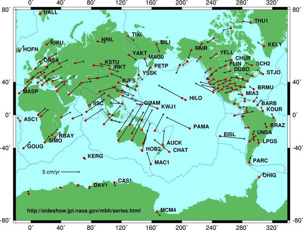

*Article initialement publié sur [Quora](https://fr.quora.com/Quels-sont-les-mouvements-des-plaques-lithosph%C3%A9riques/answer/Dr-Goulu)*

source : [Plaque tectonique — Wikipédia](w:Plaque_tectonique)

L’échelle est en bas à gauche, on voit que les vitesses sont de quelques cm par an,
ou quelques mètres par siècle,
ou quelques dizaines de km par millions d’années,
ou quelques milliers de km par centaine de millions d’années …

de quoi modifier totalement la surface de la Terre.
