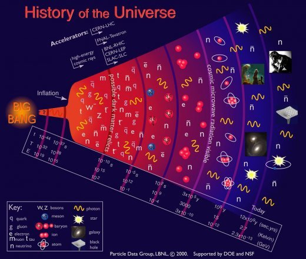

*Article initialement publié sur [Quora](https://fr.quora.com/L-infini-temporal-a-t-il-eu-un-d%C3%A9but-Comment-l-affirmer/answer/Dr-Goulu)*

Vous faussez la question en parlant d “infini temporel”. Comment savez-vous que le temps est infini ? C’est évident ? Règle No 1 en physique : méfiez vous des évidences.

Par exemple il était évident qu’il peut toujours faire plus froid : -100°C, -200°C, -300°C … et puis non. Un jour on a compris que la température est une **mesure d’autre chose**, et voilà : il y a un [Zéro absolu](w:) des températures. Et aussi une [température maximale](w:Température_de_Planck), donc les températures sont finies.

Pour le temps, on est toujours dans la situation où on ne sait pas vraiment ce que c’est. Mais on sait:

1. qu’il est très lié à l’espace. Pas d’espace = rien ne peut bouger, donc on ne voit pas bien ce que serait le temps sans espace
2. que de nombreux phénomènes physiques sont insensibles au temps, et/ou aléatoires, et/ou parfaitement réversibles (ils peuvent se produire à l’envers) . Seuls certains phénomènes, surtout macroscopiques, sont irréversibles, surtout parce que leur probabilité de se produire à l’envers est très faible. La [Flèche du temps](w:) est donc liée à la thermodynamique.
3. que dans le modèle du [Big Bang](w:), le temps est très lié à la… **température**. cf échelles T et t du graphique ci-dessous:

Si aujourd’hui le [Fond diffus cosmologique](w:) est à une température de 2,728 [K](w:Kelvin), ça définit (via l’expansion de l’Univers) assez précisément le temps depuis le BigBang.

Donc voilà : on affirme pas que le temps ait un “zéro absolu” (qui correspondrait à la température de Planck) mais c’est très possible qu’il en ait un…
