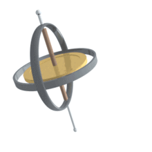

*Article initialement publié sur [Quora](https://fr.quora.com/Un-gyroscope-reste-t-il-fixe-par-rapport-%C3%A0-la-direction-de-la-gravit%C3%A9/answer/Dr-Goulu)*

Non, il tombe. Mais en tombant, la conservation du [Moment cinétique](w:) lui applique une réaction horizontale qui fait pivoter son axe, qui décrit alors un cône. C’est donc l’angle de l’axe du gyroscope avec la “direction de la gravité” qui reste constant lors de ce mouvement de précession:

