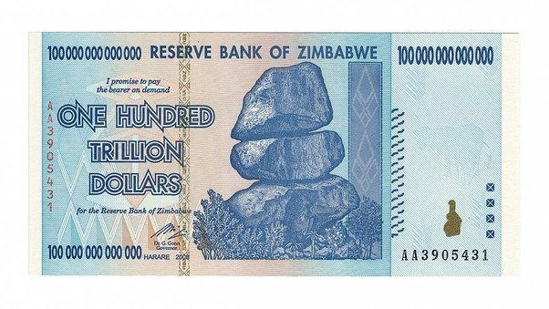

*Article initialement publié sur [Quora](https://fr.quora.com/Comment-serait-la-vie-sur-terre-si-Tout-les-monde-%C3%A9taient-milliardaire/answer/Dr-Goulu)*

La baguette ou le café coûteraient un million, c’est tout.

Il faut bien réaliser que la capitalisation boursière mondiale n’est “que” de 80′000 milliards d’euros[[1]](#mMKtA) . Avec 8 milliards d’humains, ça ne fait “que” 10′000 euros par personne. Peut-être qu’avec l’immobilier et les infrastructures on arrive au double ou au triple, mais il n’y a pas un milliard par habitant en [Valeur](w:Valeur_(économie)) sur Terre. Ni un million, et de loin. Donc le seul moyen pour que tout le monde soit milliardaire, c’est d’imprimer des billets avec plein de zéros.

Le Zimbabwe l’a fait[[2]](#JgDKZ) :

Avec ce billet de cent mille milliards de dollars zimbabwéens, vous pouviez vous acheter un Coca ou un ticket de bus, mais au moins, tous les zimbabwéens étaient multi milliardaires.

Notes de bas de page

[[1]](#cite-mMKtA)[La capitalisation boursière mondiale a fondu de 15% en 2018-WEF](https://investir.lesechos.fr/marches/actualites/la-capitalisation-boursiere-mondiale-a-fondu-de-15-en-2018-wef-1826834.php)

[[2]](#cite-JgDKZ)[Le Zimbabwe, ce pays où tous les habitants sont multi-milliardaires](https://www.capital.fr/entreprises-marches/le-zimbabwe-ce-pays-ou-tous-les-habitants-sont-multi-milliardaires-1048158)
