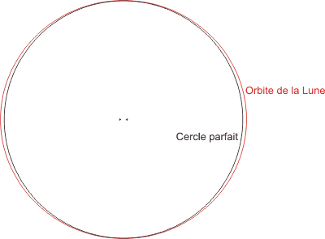

*Article initialement publié sur [Quora](https://fr.quora.com/Quelle-est-la-forme-de-la-trajectoire-de-la-Lune-autour-de-la-Terre/answer/Dr-Goulu)*

L’[Orbite de la Lune](w:) est assez compliquée dans le détail, mais en première approximation elle est très proche d’un cercle parfait :

source : [Orbite de la Lune](http://philippe.boeuf.pagesperso-orange.fr/robert/astronomie/lune-orbite.htm)
