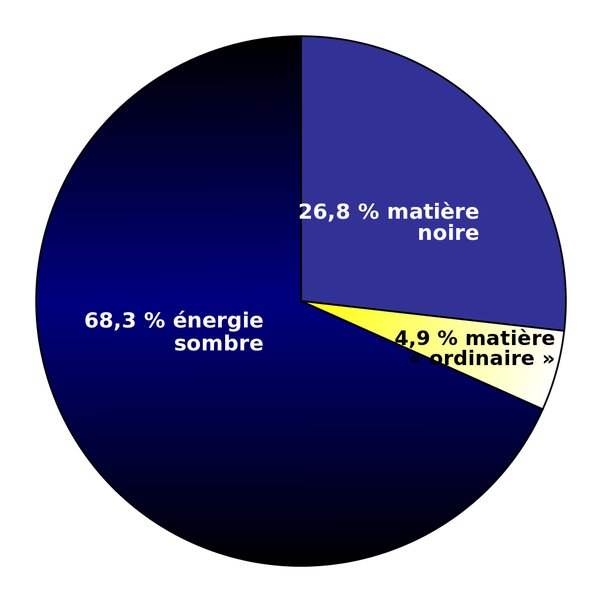

*Article initialement publié sur [Quora](https://fr.quora.com/Quels-seraient-quelques-exemples-de-ce-que-nous-pourrions-voir-avec-une-vision-am%C3%A9lior%C3%A9e-%C3%A9tant-donn%C3%A9-que-les-%C3%AAtres-humains-sont-capables-de-voir-cinq-pour-cent-de-lunivers-physique/answer/Dr-Goulu)*

Ah vous voulez parler de la proportion de matière ordinaire par rapport à la matière noire et à l'énergie sombre ? C'est plus clair parce que non seulement les humains, mais tous les animaux et la "vision améliorée" de nos instruments y compris télescopes dans les ondes radio, l'infrarouge, ultraviolet, les X et les gamma ne voient en effet que les photons émis par la matière "normale", et même que par la toute petite fraction d'icelle* qui se situe en surface des astres ou dispersées dans l'espace.

La question devient "peut-on voir l'énergie sombre ou la matière sombre ?". La réponse est que non, justement parce que ces trucs n'émettent pas de photons. En fait on a donné ces noms à des phénomènes qui ont un effet sur le champ gravitationnel, mais pas sur le champ électromagnétique (qui permet la propagation des ondes et de la lumière). Du moins actuellement, parce qu'on a calculé leur contribution dans l'Univers primordial à partir d'observations de la très faible anisotropie du [Fond diffus cosmologique.](w:Fond_diffus_cosmologique)

Les seuls instruments qui nous permettent de commencer à "voir" des effets gravitationnels sont les détecteurs d'[Ondes gravitationnelles](w:Onde_gravitationnelle). Actuellement on a deux ou trois "yeux" à un seul pixel tout justes capables de distinguer la collision d'énormes tous noirs ou d'étoiles à neutrons, qui se traduit par un "mouvement" inférieur à la taille d'un proton. Ce n'est donc pas demain qu'on pourra visualiser directement les effets très dilués des 95%.

Une autre manière de se représenter ça est que la matière "ordinaire" représente en moyenne un atome par m3 dans l'Univers. Les 95% représentent donc l'équivalent de 19 atomes par m3. Même s'ils étaient visibles, ça reste extraordinairement peu. Alors en regardant le noir d'un ciel étoilé, vous voyez en réalité 99.999999999999999 % de l'Univers : du vide.

