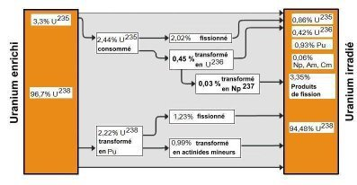

*Article initialement publié sur [Quora](https://fr.quora.com/O%C3%B9-se-trouve-le-plutonium/answer/Dr-Goulu)*

Dans les "déchets" nucléaires extraits du combustible irradié. Le plutonium 239 et 240 résulte principalement de la capture de neutrons par l'uranium 238.

