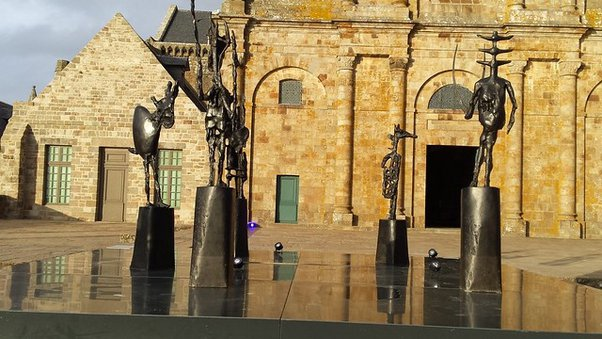
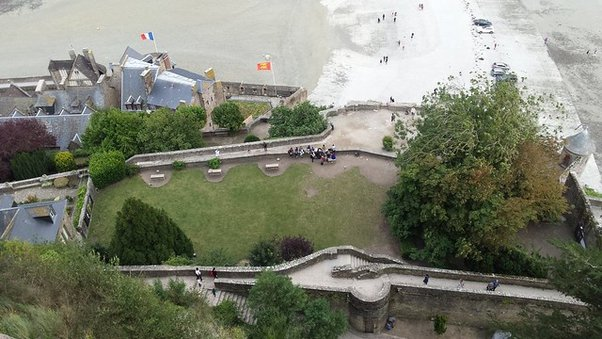

*Article initialement publié sur [Quora](https://fr.quora.com/Avez-vous-d%C3%A9j%C3%A0-visit%C3%A9-le-Mont-Saint-Michel/answer/Dr-Goulu)*

Deux fois, et c'était génial car "à rebrousse poil". Je vous donne la recette:

Vous arrivez vers 16h-17h quand les touristes repartent en masse. Vous montez au Mont, vous avez encore le temps de le visiter puis d'admirer le coucher de Soleil depuis une des terrasses. Ensuite vous dinez tranquillement, en prenant votre temps depuis votre table avec vue sur la Baie, en profitant d'un service attentionné car il y a 50 fois moins de monde qu'à midi.

Ensuite vous passez la nuit dans un des petits hôtels du Mont. Avec un peu de chance vous aurez une magnifique chambre mansardée avec une vue incroyable le matin au lever du soleil pour à peine plus cher que dans un parallélipipède à l'extérieur. Petit déjeuner, shopping décontracté à l'ouverture des échoppes, et vous repartez heureux en croisant les milliers de touristes qui déferlent pour une journée de folie et de stress.

La première fois nous avions trouvé une chambre sur place le jour même, mais c'était hors saison. La seconde nous l'avions réservée la veille, en pleine saison, preuve que ce mode de visite n'est vraiment pas courant. Mais aucun doute : nous referons comme ça la prochaine fois.

terrasse de l'Abbaye au coucher du soleil. Non, je n'ai du demander à personne de s'écarter …

Vue plongeante sur le jardin en contrebas de la même terrasse. On distingue à peine 10^2 Homines Touristicos là où il y en avait 10^4 quelques heures avant…
