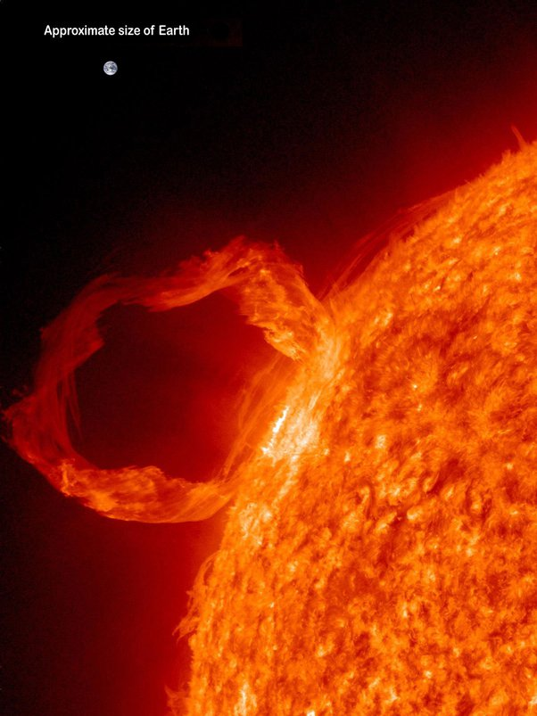

*Article initialement publié sur [Quora](https://fr.quora.com/Que-se-passerait-il-si-nous-bombardions-le-soleil-avec-des-bombes-atomiques/answer/Dr-Goulu)*

Le [Soleil](w:) fusionne environ 627 millions de tonnes d'hydrogène en 623 millions de tonnes d'helium et **convertit ainsi 4 millions de tonnes en énergie chaque seconde.**

La [Tsar Bomba](w:) de 100 mégatonnes de TNT convertit environ 4 kg de matière en énergie. Est-ce que ça répond à votre question ?

Si non, voici l'image d'une explosion d'au moins 100 Petatonnes de TNT :

