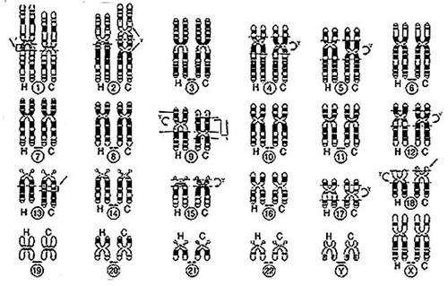

*Article initialement publié sur [Quora](https://fr.quora.com/Quelles-preuves-ont-%C3%A9t%C3%A9-utilis%C3%A9es-pour-d%C3%A9montrer-le-fait-que-les-humains-et-les-singes-ont-%C3%A9volu%C3%A9-%C3%A0-partir-dun-anc%C3%AAtre-commun-Quelle-est-la-nature-de-ces-preuves/answer/Dr-Goulu)*

A part en maths, la science ne "prouve" ni ne "démontre" rien.

Elle développe des modèles et [Théories](w:Théorie) (qui sont bien plus que des hypothèses) basées sur des observations expérimentales qui sont dans ce cas:

- les nombreux [fossiles d'hominidés](w:Liste_de_fossiles_d'hominidés) pour lesquels on a des méthodes de datation[[1]](#XxHuk) de plus en plus précises
- la comparaison génétique entre hommes et chimpanzés (qui sont plus éloignés des autres singes que de nous….) et qui donne, sous forme très compacte la figure suivante entre chromosomes humains(H) et de chimpanzés (C) [[2]](#CMbSC)

ces différences et les fossiles sont compatibles avec une évolution parallèle d'environ 5 millions d'années à partir d'un ancètre commun.

Comme tout énoncé scientifique, celui-ci est [réfutable](w:Réfutabilité) par un seul contre-exemple (expérimentalement reproductible)

Notes de bas de page

[[1]](#cite-XxHuk)[Méthode de datation - Comment estimer l'age d'un fossile - Hominidés](https://www.hominides.com/html/dossiers/methode-datation.php)

[[2]](#cite-CMbSC)[Homme et singe : ce que disent les chromosomes](https://www.futura-sciences.com/sciences/dossiers/anthropologie-anatomie-comparee-homme-singe-694/page/4/)
