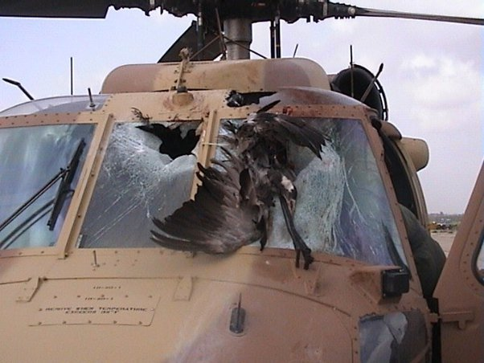

*Article initialement publié sur [Quora](https://fr.quora.com/Serait-il-une-solution-d-installer-une-grille-m%C3%A9tallique-devant-les-prises-d-air-des-jets-pour-emp%C3%AAcher-d-aspirer-les-oiseaux/answer/Dr-Goulu)*

Ca doit être encore pire si les oiseaux restent plaqués à la grille et colmatent l'entrée d'air au lieu de gentiment passer à travers le réacteur comme ça arrive dans 99% des cas…

Sans parler de la [Perte de charge](w:) qui fera chuter le rendement du réacteur …

Cela dit le [Risque aviaire](w:) est effectivement pris en compte lors de la construction d'un avion, notamment pour éviter ce genre de choses :

