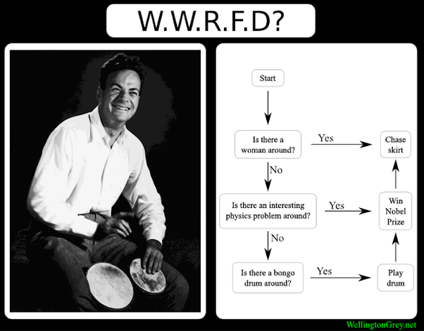

*Article initialement publié sur [Quora](https://fr.quora.com/Qui-est-Richard-Feynman-et-pourquoi-autant-de-personnes-sur-Quora-sont-fans-de-lui/answer/Dr-Goulu)*

Pour compléter l'excellente réponse de l'excellent [Fredocaster](https://fr.quora.com/profile/Fredocaster) , je dirais :

lisez "[Vous voulez rire, monsieur Feynman !"](w:Vous_voulez_rire,_monsieur_Feynman_) Vous allez être conquis par l'originalité de cet incroyable curieux, et vous marrer en même temps.

Pour ma part j'ai commencé par modéliser en 3D le fameux [éviteur d’axe](/2005/12/29/eviteur-daxe/) dont il parle dans ce bouquin, puis j'ai été tellement impressionné par certaines de ses conférences que je les ai traduites en français:

- [Il y a plein de place en bas](/2009/06/11/il-y-a-plein-de-place-en-bas-2/)
- [La science est la croyance en l'ignorance des experts](/2013/12/18/la-science-est-la-croyance-en-lignorance-des-experts/)

J'aimerais aussi traduire ses [observations personnelles sur la fiabilité de la Navette](https://science.ksc.nasa.gov/shuttle/missions/51-l/docs/rogers-commission/Appendix-F.txt) figurant dans le rapport de la [Commission présidentielle sur l'accident de la navette spatiale Challenger](w:Commission_Rogers) dont il était membre et électron libre.

Si quelqu'un veut m'aider pour cette traduction, envoyez-moi un message…

Mais rien ne vaut un petit algorithme pour bien saisir son mode de fonctionnement (WWRFD = What Would Richard Feynman Do ?)

