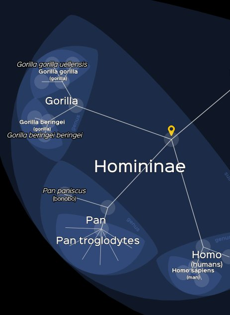
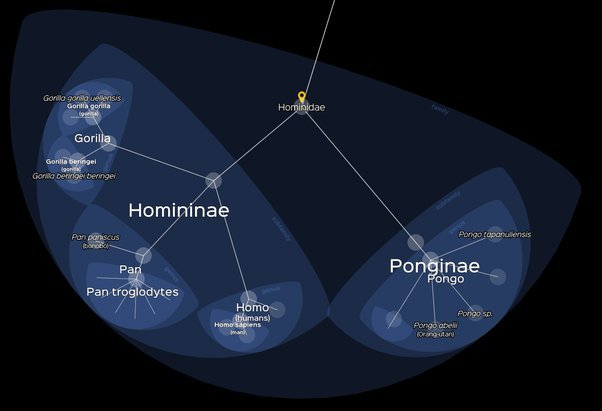
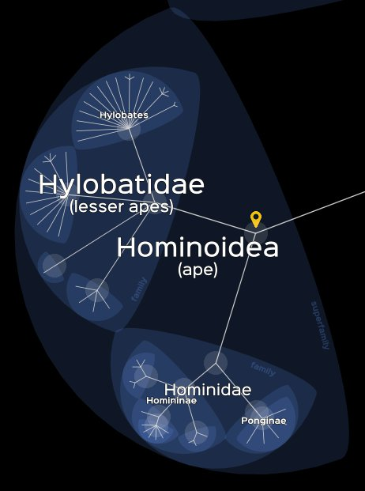
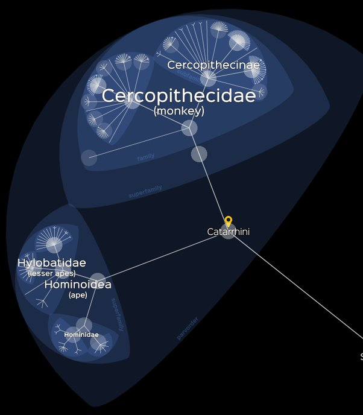
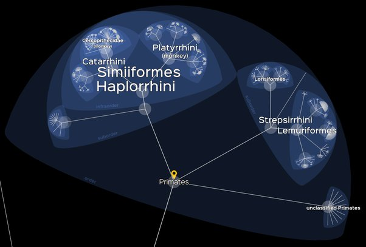
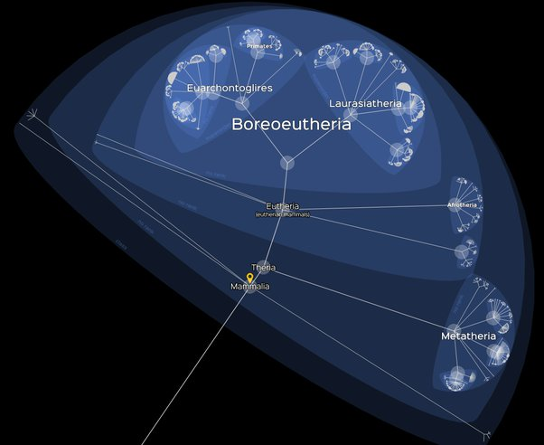
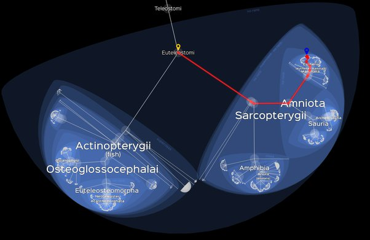
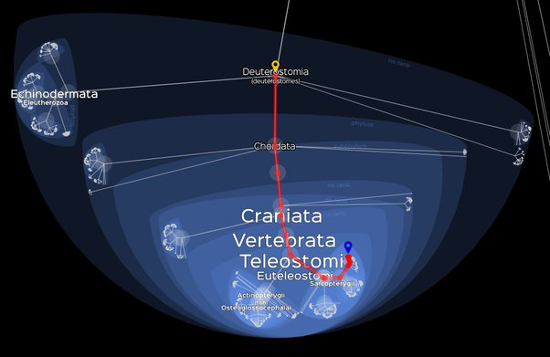
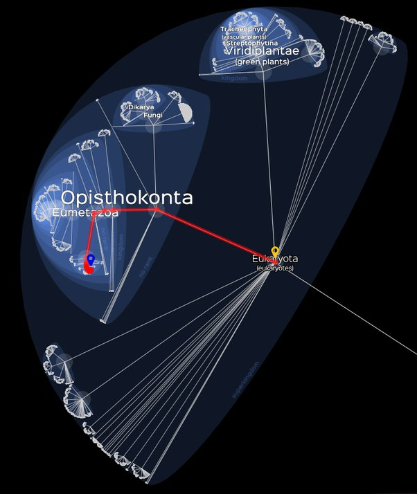
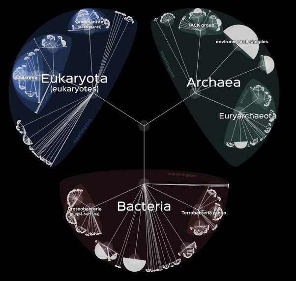

*Article initialement publié sur [Quora](https://fr.quora.com/Les-singes-et-les-humains-se-ressemblent-parce-quils-ont-des-origines-g%C3%A9n%C3%A9tiques-communes-ou-bien-un-concepteur-commun/answer/Dr-Goulu)*

Ah, le ver est dans la pomme… Si vous envisagez la possibilité que les singes et les humains puissent avoir un "concepteur commun", vous êtes un créationniste cuit.

Parce que si vous jouez avec [Lifemap](http://lifemap-ncbi.univ-lyon1.fr/) et que vous admettez un "concepteur commun" là : (les "Pan" ce sont les chimpanzés)

alors pourquoi pas un cran avant, là:

ou encore avant, là:

ou encore le cran avant, ici :

ou 5 crans avants :

ou 10 crans avants:

ou 15 : (j'ajoute le "chemin" d'Homo Sapiens pour le retrouver dans la forêt) :

ou 20 :

ou 30 :

Plus qu'un petit effort et tadâââm ! L'arbre de tous les êtres vivants apparaît sous vos yeux ébahis, où Homo Sapiens n'est qu'une des ~14 millions d'espèces vivant actuellement, chacune des branches étant tout à fait similaire à celle qui nous distingue de nos cousins chimpanzés et bonobos.

Alors le "concepteur commun", pourrait-il se trouver au centre de cette image, à l'apparition de la vie ? Peut-être… Si vous croyez fermement à son existence, c'est le dernier endroit où il peut se cacher…

Sauf que Lifemap ne répertorie pas les [Virus](w:), des trucs tellement simples qu'ils ne se reproduisent pas tout seuls, et donc on ne les considère pas vraiment comme "vivants". Il faut qu'il soient dans de "bonnes conditions" qui sont aujourd'hui l'intérieur de cellules vivants des 3 [Domaines](w:Domaine_(biologie)) ci-dessus, mais qui auraient peut-être pu être l'océan primitif, ou juste un petit lac quelque part…

C'est en (très) gros l'[Hypothèse du monde à ARN](w:) qui a les faveurs scientifiques actuellement. Et dans ce cas, la grande zone sombre au centre des 3 règnes aurait été une soupe de molécules de plus en plus complexes à l'[Origine de la vie.](w:Origine_de_la_vie) Et dans ce cas le "concepteur commun", il ne fait pas grand chose, à part la soupe…
