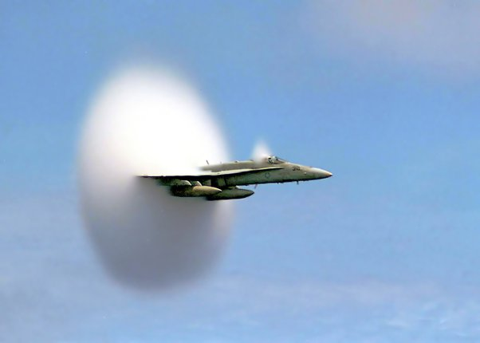

*Article initialement publié sur [Quora](https://fr.quora.com/%C3%80-quoi-ressemble-un-avion-qui-passe-le-mur-du-son/answer/Dr-Goulu)*

A ça :

Le nuage est produit par la condensation de la vapeur d'eau de l'air dans la [Singularité de Prandtl-Glauert](w:) juste derrière l'onde de choc
