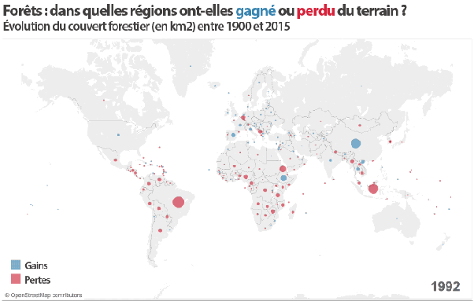
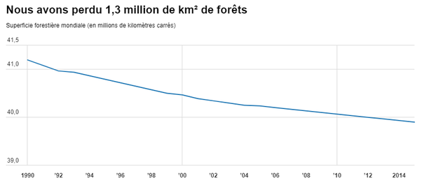

*Article initialement publié sur [Quora](https://fr.quora.com/Pourquoi-la-Terre-devient-elle-de-plus-en-plus-verte/answer/Dr-Goulu)*

Ca dépend où.

mais globalement ce n'est pas vrai.

(à moins que vous n'ayez des données plus récentes…)

Source : [5 chiffres clés pour la Journée internationale des forêts](https://blogs.worldbank.org/fr/opendata/cinq-chiffres-cles-journee-internationale-des-forets)
