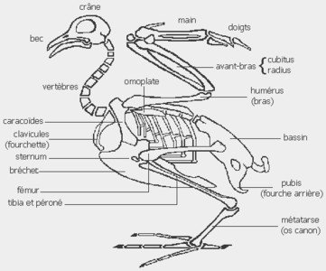

*Article initialement publié sur [Quora](https://fr.quora.com/Pourquoi-certains-animaux-ont-ils-d%C3%A9velopp%C3%A9-des-genoux-qui-se-plient-vers-l-avant-et-d-autres-vers-l-arri%C3%A8re-En-quoi-cela-est-il-avantageux/answer/Dr-Goulu)*

Il n'y a pas d'animaux qui ont un genou "vers l'arrière". Chez les oiseaux et certains mammifères (cheval) et marsupiaux (kangourou), c'est l'articulation de la cheville qui est beaucoup plus haute que chez l'homme.

En allongeant la patte, ça donne un avantage pour courir, sauter, s'envoler …
