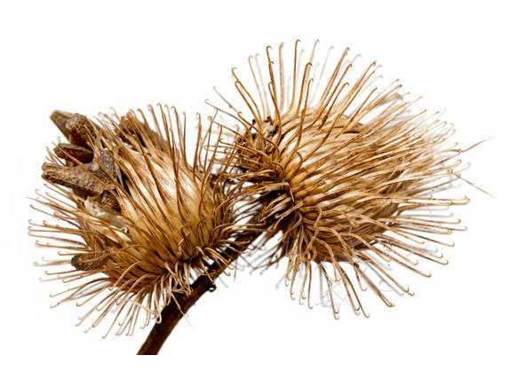
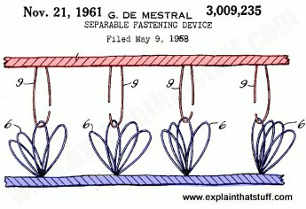

*Article initialement publié sur [Quora](https://fr.quora.com/Quelle-est-la-diff%C3%A9rence-entre-d%C3%A9couverte-et-invention/answer/Dr-Goulu)*

On **découvre** des choses qui existent déjà, par exemple que certaines plantes font des graines dotées de crochets pour - pardon Darwin - parce qu'en s'accrochant aux poils des animaux elles peuvent mieux se disséminer:

On **invente** les choses qui n'existent pas déjà, par exemple des matériaux qui utilisent le principe ci-dessus pour réaliser des fixations (le [Velcro](w:)), et accessoirement la machine pour les réaliser plus vite qu'en quelques millions d'années :

