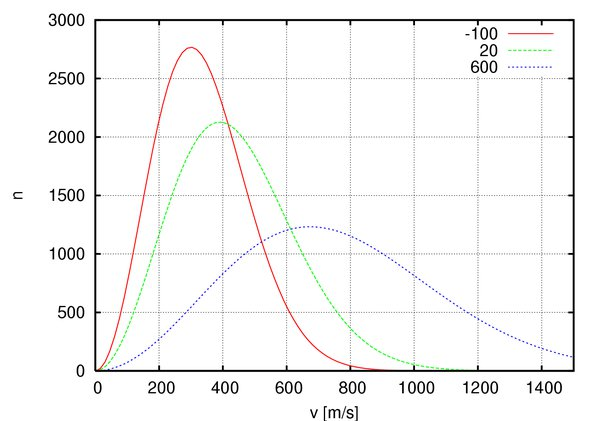

*Article initialement publié sur [Quora](https://fr.quora.com/Si-la-chaleur-est-le-d%C3%A9placement-rapide-de-particules-pourquoi-le-vent-donne-t-il-une-sensation-de-fra%C3%AEcheur/answer/Dr-Goulu)*

Excellente question !

Le [Refroidissement éolien](w:) provient du fait que le déplacement d'air élimine la "couche limite" d'air (bon isolant thermique) qui se forme à la surface de notre peau. Il apporte donc de l'air plus frais (quand il fait moins de 37°C) que celui qui se trouve en contact avec notre peau.

De plus, et surtout quand il fait plus de 37°C, il évacue cette couche limite saturée d'humidité et permet l'évaporation de notre [Transpiration.](w:Transpiration_animale)

L'apport en chaleur correspondant au vent est extrêmement faible. Selon la [Loi de distribution des vitesses de Maxwell](w:), les molécules d'air à 20°C ont une vitesse moyenne de 400 m/s (courbe verte ci-dessous, en rouge à -100°C et en bleu à 600°C), donc un vent de 10 m/s (36 km/h) correspond à une fraction de degré :

