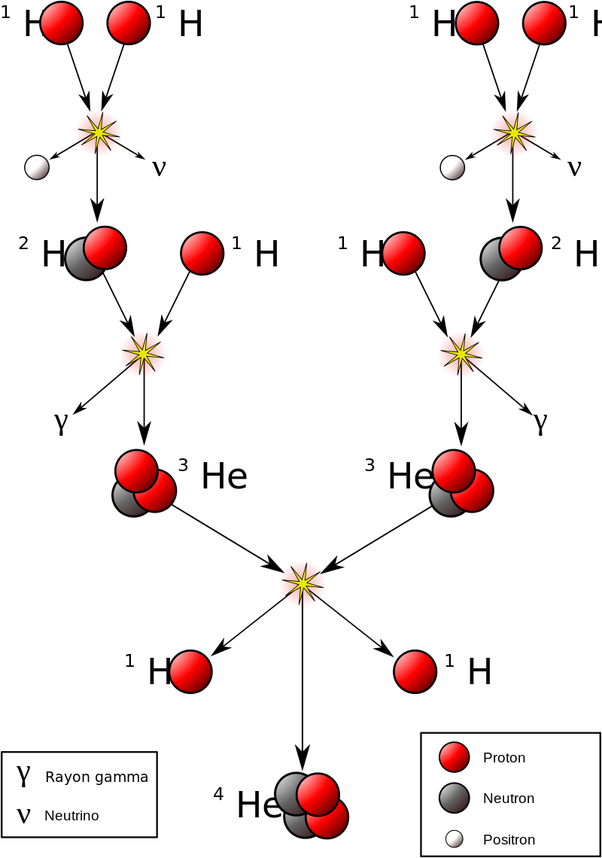

*Article initialement publié sur [Quora](https://fr.quora.com/Comment-la-fusion-et-la-fission-nuclaire-se-fait-elle-sur-le-soleil/answer/Dr-Goulu)*

Il n'y a pas de fission dans le [Soleil](w:), que de la fusion, et ce n'est pas "sur" le Soleil, mais seulement en son [Noyau](w:Noyau_solaire), ou coeur.

La réaction est la [Chaîne proton-proton](w:) qui convertit de l'Hydrogène (dont le noyau est un proton) en Helium 3 puis 4 ainsi :

