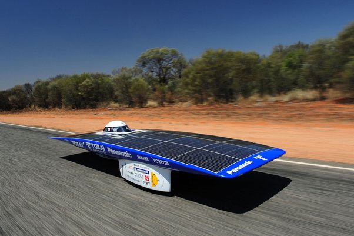

*Article initialement publié sur [Quora](https://fr.quora.com/Pourquoi-n-y-a-t-il-pas-de-voitures-qui-roulent-%C3%A0-l-%C3%A9nergie-solaire/answer/Dr-Goulu)*

Une Tesla consomme en moyenne 15 kW de puissance. L'énergie solaire est de 1 kW/m² sur une surface correctement orientée. Les meilleures cellules ont un rendement de 25%, donc il vous faut 60 m2 de panneaux solaires bien orientés pour alimenter votre bagnole en continu. Sachant que la carrosserie de votre bagnole fait à tout casser 10 m2 orientés dans tous les sens, votre seule chance est d'opter pour une [Voiture solaire](w:) comme [Tokai Challenger](w:en:Tokai_Challenger)

qui marche très bien en Australie à plat, en plein soleil, sans ombre, avec une puissance de 1.8 kW au lieu des 15 de la Tesla.

Et pour le modèle adapté à une virée nocturne ou avec chauffage pour l'hiver, il faut attendre …
