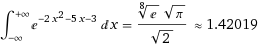

*Article initialement publié sur [Quora](https://fr.quora.com/Comment-puis-je-trouver-intlimits-infty-infty-e-2x-2-5x-3-dx/answer/Dr-Goulu)*

Je me fatigue plus : [Wolfram|Alpha: integral e^(−2x^2−5x−3) from -inf to +inf](https://www.wolframalpha.com/input/?i=integral+e^(−2x^2−5x−3)+from+-inf+to++inf) donne immédiatement:

