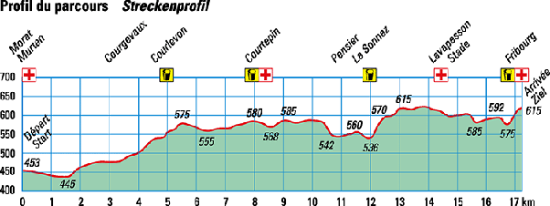

*Article initialement publié sur [Quora](https://fr.quora.com/Quelle-est-la-signification-physique-d-une-d%C3%A9riv%C3%A9e/answer/Dr-Goulu)*

La [Dérivée](w:) mesure l'ampleur du changement de la valeur de la fonction (valeur de sortie) par rapport à un changement de son argument (valeur d'entrée).

La dérivée de la position d'un objet par rapport au temps est sa vitesse.

La dérivée de l'altitude par rapport aux kilomètres parcourus est une pente.
Là où la dérivée est nulle, on a un maximum ou un minimum local de la (courbe de la) fonction

