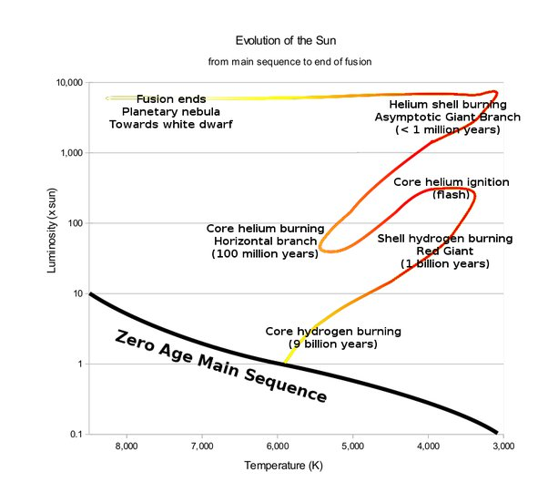

*Article initialement publié sur [Quora](https://fr.quora.com/Est-on-s%C3%BBrs-que-le-soleil-deviendra-une-g%C3%A9ante-rouge-c-est-%C3%A0-dire-qu-elle-aura-assez-de-temp%C3%A9rature-en-son-c%C5%93ur-pour-transmuter-du-carbone-soit-100-millions-de-degr%C3%A9s-voir-le-flash-de/answer/Dr-Goulu)*

Selon [Soleil - Evolution - Wikipédia](w:Soleil) y'a pas photo . La trajectoire du Soleil dans le [Diagramme de Hertzsprung-Russell](w:Diagramme_Hertzsprung-Russell) est la suivante, identique pour toutes les étoiles d'une masse solaire:

On voit que le Soleil va être une géante rouge deux fois.D'abord

> Lorsqu’il sera âgé de 10,5 milliards d’années, l’équilibre hydrostatique sera rompu. (…) le Soleil aura un diamètre environ 100 fois supérieur à l’actuel, et sera près de 2 000 fois plus lumineux. Sa photosphère dépassera l’orbite de [Mercure](w:Mercure_(planète)) et de [Vénus](w:Vénus_(planète)). La [Terre](w:), si elle subsiste encore, ne sera plus qu’un désert calciné. **Cette phase de géante rouge durera environ 1 milliard d'années**.

Ensuite ce sera le fameux "flash de l'helium" :

> À la fin de sa phase de géante rouge, son cœur d'hélium sera en [état dégénéré](w:Matière_dégénérée), sa température, augmentant par contraction de l'hélium produit par la couronne externe du cœur, arrivera aux environs de 100 millions de kelvins, initiant les réactions de fusion de l’[hélium](w:) pour donner du carbone (voir [réaction triple-alpha](w:)) ainsi que de l'oxygène. Cette ignition de l'hélium sera brutale : ce sera le [flash de l’hélium](w:), suivi d'un réarrangement des couches du Soleil faisant diminuer son diamètre jusqu’à ce qu’il se stabilise à une taille de plusieurs fois (jusqu’à 10 fois) sa taille actuelle, soit d’environ 10 millions de kilomètres de diamètre. Il sera devenu une sous-géante, avec environ 50 fois sa luminosité actuelle.
>
>
>
> La période de fusion de l'hélium durera environ 100 millions d'années, les noyaux d'hélium se combineront trois par trois pour former des noyaux de carbone, qui peupleront le cœur de la géante rouge, avec production d'un peu d'oxygène par ajout d'un noyau d'hélium supplémentaire au carbone. Durant cette phase, le Soleil deviendra de nouveau plus grand et plus lumineux.

Et après ça:

> Enfin, lorsque l'hélium au centre du cœur sera entièrement transformé en carbone et en oxygène, il va **redevenir une géante rouge**, ce sera la phase de la [branche asymptotique des géantes](w:), qui durera approximativement 20 millions d'années. Dans cette phase, 2 couronnes de fusion auront lieu en son cœur : une externe fusionnant l'hydrogène, une interne fusionnant l'hélium. Dans cette configuration, le Soleil sera très instable : les couronnes de fusion variant alternativement de puissance. Cela produira de puissants pulses qui finiront par souffler les couches externes. Le Soleil aura perdu environ la moitié de sa masse.
>
>
>
> Le Soleil ne sera **plus assez massif pour atteindre la température de 600 millions de K nécessaire à la**[**fusion du carbone**](w:Fusion_du_carbone), produisant du néon, du sodium et du magnésium.

Pas besoin de [Madame Soleil](w:), la physique permet de prévoir la vie du Soleil sur des milliards d'années avec une certitude scientifique provenant de l'observation de millions d'étoiles. A moins qu'il fasse une mauvaise rencontre, évidemment…
