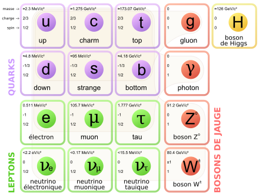

*Article initialement publié sur [Quora](https://fr.quora.com/Le-photon-est-sa-propre-antiparticule-si-je-ne-m-abuse-pas-n-y-a-t-il-pas-un-principe-logique-disant-qu-une-chose-ne-peut-pas-%C3%AAtre-simultan%C3%A9ment-son-contraire-Est-ce-contradictoire/answer/Dr-Goulu)*

Une [Antiparticule](w:) est une particule du [modèle standard](w:Modèle_standard_(physique)) de masse et spin égaux à ceux de la particule correspondante, mais de [Charge électrique](w:) opposée.

Elle ne s'annule pas avec une particule comme +1–1=0. L'[Annihilation](w:Annihilation_(physique)) ne produit pas "rien", mais de nouvelles particules dont l'énergie totale égale celles des particules annihilées.

Bref, pour les particules qui n'ont pas de charge électrique comme le photon, le gluon, le boson Z et le boson de Higgs , on dit qu'elles "sont leur propre antiparticule" dans le sens qu'une particule de charge opposée (-0=0) est identique à la particule… mais elles ne s'annihilent pas si elles se rencontrent, donc c'est un peu un abus de langage…

Pour les neutrino il y a un petit flou parce qu'en fait j'ai menti. La définition rigoureuse de l'antiparticule c'est que les [Nombre quantiques](w:Nombre_quantique) sont inverses, pas seulement la charge électrique, qui est le nombre quantique des particules courantes. Or il semblerait que les neutrinos ont un autre nombre quantique, le "moment dipolaire" qui soit non nul, ce qui ferait qu'ils ont des antiparticules distinctes. Le problème est que les neutrino ne sont pas faciles à détecter, et qu'en plus ils [oscillent](w:Oscillation_des_neutrinos), donc pour l'instant, on n'est pas surs…
