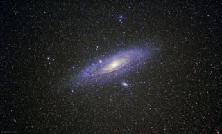
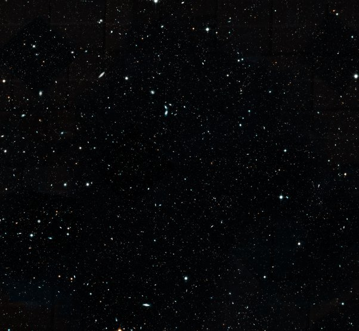

*Article initialement publié sur [Quora](https://fr.quora.com/Lunivers-est-compos%C3%A9-de-plusieurs-galaxies-th%C3%A9orie-ou-bien-r%C3%A9alit%C3%A9-Quels-outils-ont-permis-si-cela-est-v%C3%A9ridique-de-laffirmer/answer/Dr-Goulu)*

Vous trouverez sans peine de nombreuses photos de nombreuses galaxies prises par de nombreux télescopes sur Terre et dans l'espace, mais je voudrais vous montrer celle-là:

Cette photo de la [Galaxie d'Andromède](w:) a été prise par un astronome amateur, SANS télescope, avec un bon appareil photo moderne, un objectif raisonnable (200 mm) et 45 secondes d'exposition rendues possibles par une monture motorisée [[1]](#cevVC) .

Avec des instruments plus puissants on arrive à distinguer certaines étoiles des autres galaxies, notamment [plusieurs supernovas](w:Liste_de_supernovas) chaque année, et des [Céphéides](w:Céphéide), des étoiles dont la luminosité varie de manière périodique selon une [Relation période-luminosité](w:) connue grâce aux céphéides de notre galaxie.

On peut ainsi déterminer la distance des galaxies "proches", et utiliser le [Décalage vers le rouge](w:) pour approximer la distance des galaxies lointaines.

Avec ça on peut affirmer:

1. que les galaxies sont des objets beaucoup plus lointains que les étoiles que nous voyons dans notre ciel. En fait il y en a jusque tout près des limites de l' [Univers observable](w:) (500 millions d'années après le BB)
2. que ces galaxies sont elles-mêmes composées d'étoiles semblables à celles de notre galaxie
3. qu'en fonction de leur histoire les galaxies peuvent avoir des formes différentes mais que notre galaxie n'a rien de particulier
4. qu'il y a des centaines de milliards de galaxies contenant chacune des centaines de milliards d'étoiles.

Voici une image prise par Hubble[[2]](#pmhWw) d'un carré de ciel où ne se trouve qu'une dizaine d'étoiles de notre galaxie (les points tout ronds avec des "pointes"[[3]](#tjYoA) ). Toutes les autres taches lumineuses, même les plus faibles sont des galaxies.

Notes de bas de page

[[1]](#cite-cevVC)[Amazing Andromeda Galaxy View Captured by Amateur Astronomer (Photo)](https://www.space.com/26742-amazing-andromeda-galaxy-night-sky-photo.html)

[[2]](#cite-pmhWw)[Hubble Assembles Wide View of Evolving Universe](https://www.nasa.gov/feature/goddard/2019/hubble-astronomers-assemble-wide-view-of-the-evolving-universe)

[[3]](#cite-tjYoA)[Inventaire des Croix du Ciel. - Pourquoi Comment Combien](/2009/01/17/inventaire-des-croix-du-ciel/)
