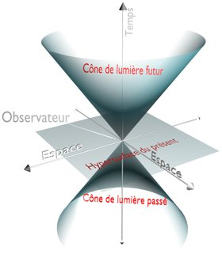

*Article initialement publié sur [Quora](https://fr.quora.com/Est-ce-que-l-affirmation-de-la-b%C3%A9d%C3%A9-Quantix-comme-quoi-la-vitesse-de-d%C3%A9placement-dans-le-temps-ajout%C3%A9e-%C3%A0-celle-du-d%C3%A9placement-dans-l-espace-est-une-constante-c-est-vraiment-exacte-%C3%87a/answer/Dr-Goulu)*

Mouais, elle m'a l'air un peu "survulgarisée" cette BD. Effectivement la notion de "vitesse dans le temps" est un peu discutable, et l'additionner à la "vitesse dans l'espace" l'est encore plus…

Personnellement je préfère l'expliquer ainsi (dites moi si c'est plus clair… ou pas…):

- la relativité voit le temps comme une dimension perpendiculaire à l'espace. Si vous connaissez les nombres complexes, on peut même dire que [Le temps est une 4ème dimension imaginaire](/2007/02/07/le-temps-une-4eme-dimension-imaginaire/) au sens mathématique, comme on le voit dans la [Métrique de Minkowski](w:). Et si vous n'êtes pas bon en maths, vous pouvez voir le temps comme l'épaisseur d'un flipbook, perpendiculaire aux pages (2D) et formant une dimension d'une "nature" différente:



- Historiquement nous avons inventé le mètre pour mesurer l'espace et la seconde pour mesurer le temps, mais la relativité nous a montré de multiples manières que ces deux unités sont fondamentalement liées par la constante universelle c. A tel point qu'aujourd'hui le [Mètre est défini](w:Mètre) à partir de la seconde et de c.
- c est la pente du [Cône de lumière](w:) sur lequel se trouve tous les événements passés perçus comme simultanés par un observateur (au sommet du cône), et tous les observateurs futurs qui verront l'événement du sommet du cône comme simultané avec un événement local pour eux.

- la valeur de c de 299’792’458 m/s provient de nos unités, le mètre et la seconde. Mais la "vraie" valeur de c dans un [Système d'unités naturelles](w:) ne peut être que 1. Un. Sans unités. Ce sont les unités qu'il faut définir à partir de c, pas l'inverse. C'est ce que font les [Unités de Planck](w:), mais elles ne sont pas pratiques à notre échelle, alors il n'y a que les physiciens qui les utilisent.

voir aussi [La vitesse de la lumière sur mes Réponses Fréquentes](/2017/2017-12-28-la-vitesse-de-la-lumiere)
