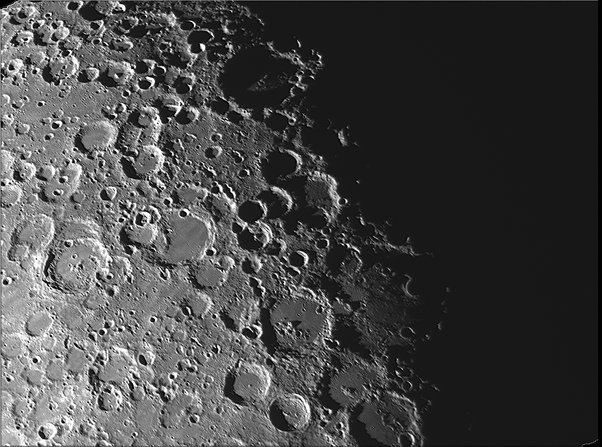

*Article initialement publié sur [Quora](https://fr.quora.com/Les-phases-de-la-Lune-ont-elles-des-sp%C3%A9cificit%C3%A9s/answer/Dr-Goulu)*

Autant qu'un ballon éclairé sous différents angles.

J'aime beaucoup observer le [Terminateur de la Lune,](w:Terminateur) il révèle magnifiquement le relief.

Avec un peut de trigo, on peut même mesurer la profondeur des cratères…
