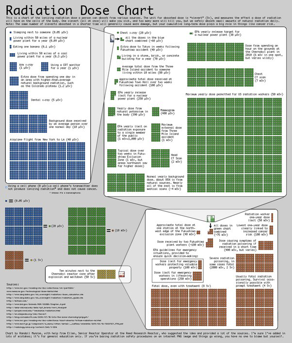

*Article initialement publié sur [Quora](https://fr.quora.com/Quels-sont-les-effets-du-nucl%C3%A9aire-sur-le-corps-humain/answer/Dr-Goulu)*

L'impact sur les [tissus biologiques](w:Tissu_biologique) d'une [exposition](w:Irradiation) à un [rayonnement ionisant](w:), par exemple à une source de [radioactivité](w:) se mesure en [Sievert](w:), unité de [Dose équivalente](w:).

La “dose équivalente” de [radioactivité naturelle](/2013/11/03/la-radioactivite-naturelle/) annuelle reçue par un français moyen est de 2.4 milliSievert [mSv], décomposée comme suit:

- 0.6 [mSv] reçus de la désintégration des radio-isotopes primordiaux dans le sol (Uranium et Thorium)
- 0.4 [mSv] reçus par les rayons cosmiques. Pour un pilote professionnel, ce poste peut augmenter à plus de 5 [mSv]
- 0.2 [mSv] de potassium 40 et de carbone 14 ingérés par les aliments, qui représentent à eux deux 8000 Bequerels des 8500 typiquement mesurés sur un humain de 70 kg. Mais ces éléments produisent des rayons beta peu nocifs
- Plus de la moitié de la dose moyenne soit 1.3 [mSv] provient de l’inhalation de [radon](http://www.wikipedia.org/search-redirect.php?language=fr&go=Go&search=radon), qui peut être beaucoup plus importante suivant les endroits

Les normes en France sont que la population ne devrait pas être exposée à 1 mSv/an de radioactivité artificielle supplémentaire (radiographies comprises) et 20 mSv pour les professionnels du nucléaire (y compris les radiologues etc.).

Ces normes sont très sévères puisque les premiers effets (malformations d'embryons) ne se remarquent que vers 50 mSV et qu'il existe des endroits sur Terre où des populations boivent de l'eau radioactive depuis des siècles sans impact notable sur leur santé (130 mSv/an à Ramsar, en Iran).

Les doses létales à 50% sont de ~1000 mSv pour les embryons en début de grossesse à 5000 mSv pour les adultes. Les habitants d'Hiroshima et Nagasaki ont pris 1200 mSV à 10km de l'explosion, et les habitants de Tchernobyl 450 mSv.

(source : [Échelles et effets de doses de radiation — Wikipédia](w:Échelles_et_effets_de_doses_de_radiation))

[https://xkcd.com/radiation/](https://xkcd.com/radiation/) montre ce graphique génial pour se faire une idée de ces doses:

