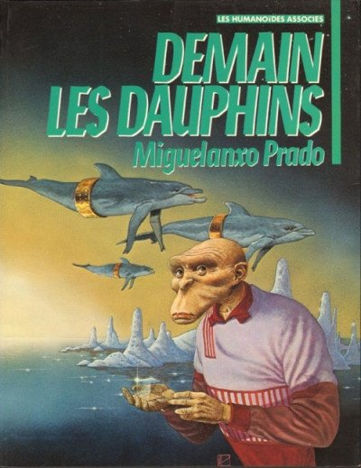

*Article initialement publié sur [Quora](https://fr.quora.com/Quelle-esp%C3%A8ce-serait-la-plus-susceptible-de-d%C3%A9passer-l-humain-intellectuellement-dans-le-futur/answer/Dr-Goulu)*

Silicium Processor, l'espèce artificielle que nous sommes en train de créer.

Et si nous échouons , j'espère que le scénario de cette géniale BD de 1988 se réalisera :

