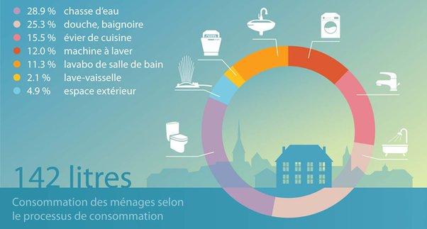

*Article initialement publié sur [Quora](https://fr.quora.com/Seriez-vous-pr%C3%AAt-%C3%A0-r%C3%A9duire-vos-douches-de-moiti%C3%A9-et-%C3%A0-ne-tirer-la-chasse-d-eau-que-fr%C3%A9quemment-lorsque-cela-est-vraiment-n%C3%A9cessaire-pour-aider-votre-pays-%C3%A0-lutter-contre-une-grave-p/answer/Dr-Goulu)*

Bien sur. J'aime bien les zones désertiques (Atacama dans 3 semaines…) où on s'aperçoit qu'on peut très bien se "doucher" avec une lavette humide, et que les WC sèches vont très bien s'il n'y a pas de rocher derrière lequel faire ses besoins, très vite recyclés par la faune locale d'ailleurs.

Sérieusement, utiliser de l'eau potable pour diluer son urine jusqu'à la station d'épuration est une aberration totale, le summum du gaspillage.

