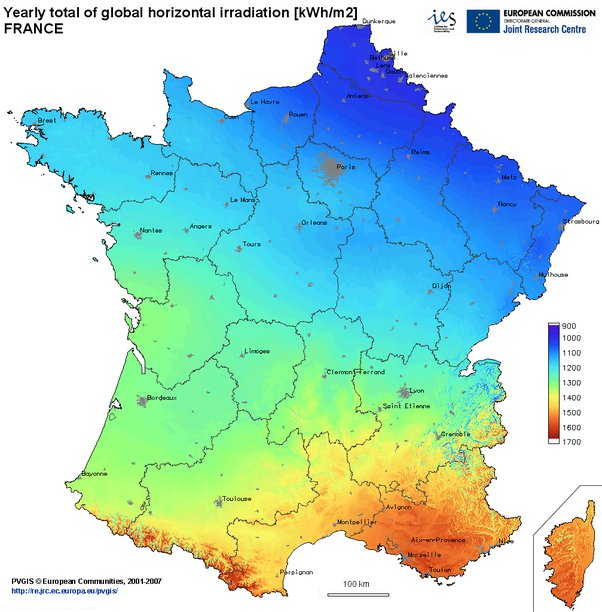
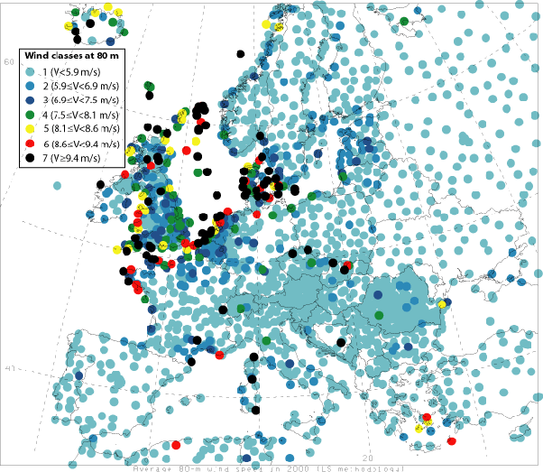
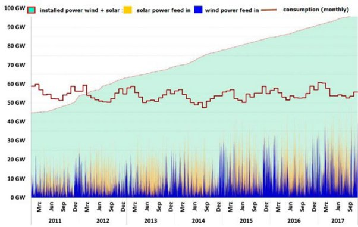

*Article initialement publié sur [Quora](https://fr.quora.com/Pourquoi-ne-met-on-pas-tout-simplement-des-panneaux-solaires-et-des-%C3%A9oliennes-partout-en-France-pour-ne-plus-avoir-%C3%A0-utiliser-le-nucl%C3%A9aire/answer/Dr-Goulu)*

Parce que les français aiment bien avoir de l'électricité aussi les soirs sans vent.

Les panneaux solaires produisent de l'électricité pendant la journée, surtout l'été, et le double au Sud qu'au Nord:[[1]](#HHtdu)

Pour le vent c'est le contraire [[2]](#cqJlv) :

Le fait est que le [Facteur de charge](w:Facteur_de_charge_(électricité)) du solaire est de l'ordre de 10%, et celui de l'éolien de 20%, alors que le nucléaire est à au moins 75%. Il faudrait donc installer 8x plus de puissance solaire que de nucléaire, ou 4x plus de puissance éolienne que de nucléaire pour produire la même énergie annuelle. Plus les lignes électriques pour amener le jus près des consommateurs …

Mais surtout, la production éolienne est TRES variable car la puissance d'une éolienne varie comme le cube de la vitesse du vent.

Dans le graphique suivant vous voyez que la puissance installée solaire+éoliennes de l'Allemagne (surface verte) est désormais le double de la consommation moyenne (brune), pourtant les pics quotidiens du solaire (jaune) et très variables de l'éolien (bleu) ne permettent jamais d'atteindre le niveau de la consommation :

Par contre quand solaire+éolien s'additionnent et dépassent la consommation, il n'existe actuellement aucun moyen de stocker cette énergie[[3]](#KWlFh) , qui est de plus en plus souvent "vendue" à prix négatif [[4]](#zPokD) [[5]](#obQyW) !

Il faut donc qu'une autre source d'énergie puisse compenser le manque. Or il n'y a actuellement aucune technologie à part l'hydraulique qui permette d'enclancher la production de gigawatts en quelques heures. Mais il faut des montagnes et de l'eau.[[6]](#LVJIx) . Sans énormes capacité de stockage, le renouvelable est condamné à la surproduction.

L'obstacle à la généralisation des renouvelables est donc un peu technique, mais surtout financier. Si vous êtes prêts à payer votre électricité 3 ou 4 fois plus cher qu'actuellement (car il faut installer 3 ou 4 fois plus de puissance) , à tirer des lignes à travers tout le pays pour alimenter le Nord en solaire le soir et le Sud en éolien la nuit, et à vous acheter des batteries pour la stocker, allez-y !

Notes de bas de page

[[1]](#cite-HHtdu)[solar radiation maps for European countries](https://re.jrc.ec.europa.eu/pvgis/countries/countries-europe.htm)

[[2]](#cite-cqJlv)[Global wind power at 80 m](http://www.stanford.edu/group/efmh/winds/global_winds.html)

[[3]](#cite-KWlFh)[Comment stocker l'énergie - Pourquoi Comment Combien](/2012/10/07/comment-stocker-lenergie/)

[[4]](#cite-zPokD)[Qui veut de l'électricité à prix négatif ? - Pourquoi Comment Combien](/2011/01/15/qui-veut-de-lelectricite-a-prix-negatif/)

[[5]](#cite-obQyW)[Prix négatifs - Questions réponses](https://www.epexspot.com/fr/epex_spot_se/fondamentaux_du_marche_de_l_electricite/Prix_négatifs)

[[6]](#cite-LVJIx)[Potentiel hydroélectrique - Pourquoi Comment Combien](/2008/09/06/potentiel-hydroelectrique/)
