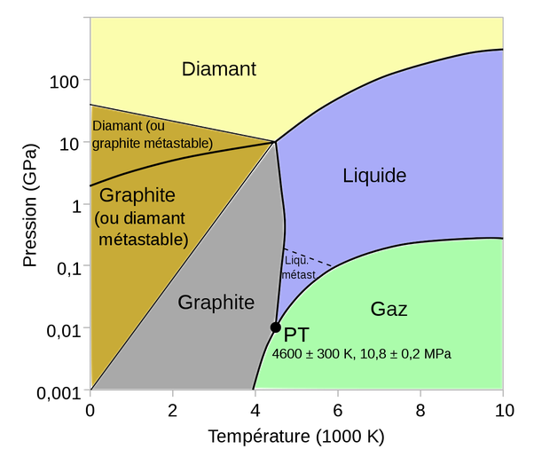

*Article initialement publié sur [Quora](https://fr.quora.com/Quadvient-il-si-vous-essayez-de-faire-fondre-la-fibre-de-carbone/answer/Dr-Goulu)*

[Carbone — Wikipédia](w:Carbone) :

> À pression atmosphérique le carbone (graphite) se [sublime](w:Sublimation_(physique)) à 4 100 [K](w:Kelvin) . Sous forme gazeuse, il se constitue habituellement en petites chaînes d'atomes appelées [carbynes](w:Carbyne). Refroidies très lentement, celles-ci fusionnent pour former les feuilles graphitiques irrégulières et déformées qui composent la [suie](w:). Parmi ces dernières, on trouve en particulier, la forme sphérique monofeuillet C60 appelée [fullerène](w:), ou plus précisément [buckminsterfullerène](w:), et ses variétés C*n*(20 ≤ *n* ≤ 100), qui forment des structures extrêmement rigides.
>
>
>
> Le carbone liquide ne se forme qu'au-dessus de la [pression](w:) et de la [température](w:) du [point triple](w:), et donc au-delà de 10,8 ± 0,2 MPa et 4 600 ± 300 K

petit diagramme de phase bienutile pour fabriquer du diamant :

