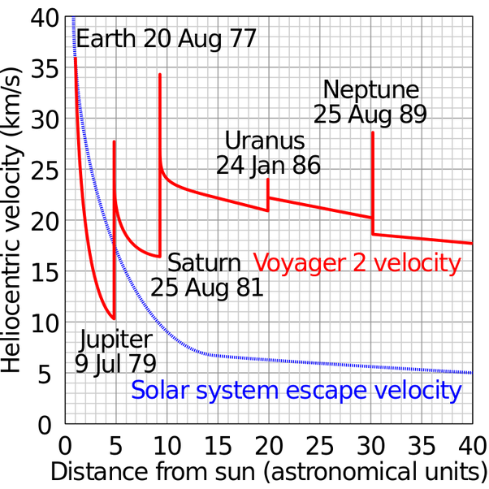

*Réponse publiée [sur Quora](https://fr.quora.com/Si-une-masse-de-1-kg-est-%C3%A9ject%C3%A9-de-l-attraction-terrestre-a-la-vitesse-de-30000km-h-quelle-acc%C3%A9l%C3%A9ration-maximum-pourrait-elle-atteindre-dans-le-cosmos/answer/Dr-Goulu)*

30'000 km/h (8.3 km/s) est inférieure à la [Vitesse de libération](w:) de la Terre qui est de 40'320 km/h (11.2 km/s) : votre kilo n'est pas "éjecté de l'attraction terrestre". Il retombe sur Terre, ou se met éventuellement en orbite.

Pour le lancer "dans le cosmos", il faut une vitesse de 42 km/s, soit 151'200 km/h, qui est la vitesse de libération du Soleil à partir de l'orbite terrestre. Ou le lancer un peu moins vite et utiliser l'[Assistance gravitationnelle](w:) de Jupiter et/ou Saturne pour passer au dessus de la vitesse de libération du Soleil au niveau de leurs orbites.

C'est ce qu'on fait les sondes Voyager 1 et 2 qui ne sont pas encore sorties de l'attraction du Soleil, mais s'en éloignent encore à environ 60'000km/h

