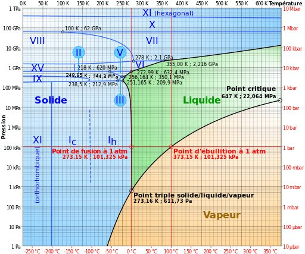

*Réponse publiée [sur Quora](https://fr.quora.com/Pourrait-il-y-avoir-une-plan%C3%A8te-100-deau-donc-vous-pourriez-th%C3%A9oriquement-plonger-dun-c%C3%B4t%C3%A9-%C3%A0-lautre/answer/Dr-Goulu)*

Oui, une [Planète-océan](w:) constituée presque uniquement d'eau n'est pas exclue.

"Presque" parce qu'inévitablement il y aura un peu d'autres matériaux, donc un petit noyau métallique et/ou rocheux.

Pour la plongée, c'est une autre histoire…

Imaginons une planète de la taille de la Terre avec un océan de 6000 km de profond. Au centre, vous avez une pression de 600'000 bars , 600 tonnes par cm2, 60 GPa …

Aucun matériau ne permet de faire un engin sous marin quelconque résistant à ça.

**Edit :** En fait le centre de la planète sera forcément de la glace vu la pression, comme l'a très bien fait remarquer [Adrien Coffinet](https://fr.quora.com/profile/Adrien-Coffinet) dans [son commentaire](https://fr.quora.com/Pourrait-il-y-avoir-une-plan%C3%A8te-100-deau-donc-vous-pourriez-th%C3%A9oriquement-plonger-dun-c%C3%B4t%C3%A9-%C3%A0-lautre/answer/Philippe-Guglielmetti/comment/107711756) !

D'après le diagramme de phase de l'eau et de SES glaces [[1]](#UsohC)au dessus de 632 MPa à 0°C ou 2.2 GPa à 100°C on a de la glace VI, VII, X ou XI …

A 60 GPa, il faudrait que le centre de la planète soit autour de 500°C, ce qui n'est pas vraisemblable tant la bonne conduction thermique de l'eau et les mouvements de convection thermique équilibreraient vite les températures.

Notes de bas de page

[[1]](#cite-UsohC)[La glace-9 de Vonnegut peut-elle exister ? - Pourquoi Comment Combien](/2012/11/05/glace-9/)
