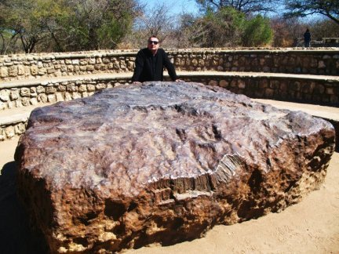

_Réponse publiée_ [_sur Quora_](https://fr.quora.com/Comment-savent-ils-que-le-poignard-de-Toutankhamon-a-%C3%A9t%C3%A9-fabriqu%C3%A9-%C3%A0-partir-de-fer-provenant-dune-m%C3%A9t%C3%A9orite/answer/Dr-Goulu)

> Selon Daniela Comelli, du département de physique de l'Ecole Polytechnique de Milan (Italie), l'une des co-signataires de l'article "_les concentrations en nickel et les quantités (plus faibles) de cobalt, phosphore, carbone et soufre décelées dans la lame sont typiques du fer d'origine météoritique"_. En effet, une présence de 10% de nickel a été enregistrée, là où elle est d'environ 4% pour du minerai terrestre.[[1]](#gpkOV)

J'ai eu la chance de voir le plus gros bloc de fer disponible à la surface de la Terre avant l'invention du haut-fourneau, la météorite de Hoba, en Namibie[[2]](#MIQYP) :

Ce qu'on ne voit pas bien sur la photo, c'est que les endroits coupés par des vandales sont brillants comme du miroir. Cette météorite est une [ataxite](http://www.wikipedia.org/search-redirect.php?language=fr&go=Go&search=ataxite) composée de 84% de fer et 16% de nickel.

Si j'avais été pharaon, j'aurais retenu ma respiration jusqu'à ce qu'on me fasse une épée plus grosse que celle de Toutankhamon avec …

Notes de bas de page

[[1]](#cite-gpkOV)[Poignard de Toutankhamon : il a été forgé dans un métal extraterrestre](https://www.sciencesetavenir.fr/archeo-paleo/archeologie/poignard-de-toutankhamon-il-a-ete-forge-dans-un-metal-extraterrestre_101812)

[[2]](#cite-MIQYP)[Namibie - Pourquoi Comment Combien](/2010/08/28/namibie/)
