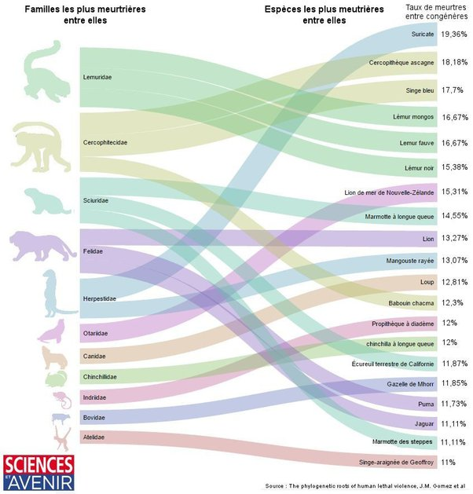

*Réponse publiée [sur Quora](https://fr.quora.com/Lesp%C3%A8ce-humaine-est-elle-celle-dont-les-individus-sentre-tuent-le-plus-Si-oui-pourquoi/answer/Dr-Goulu)*

Oh que non, et de très loin.

Les mammifères les plus meurtriers (de leur propre espèce donc…) sont les si mignons, si jolis suricates[[1]](#XzciO) . Près de 20% des suricates meurent tués par un autre suricate.

Chez les humains, c'est 10 fois moins : 2%. En comptant tout : guerres, infanticides, drames passionnels, crimes crapuleux etc. ,C'est moitié moins que les gorilles de l'Est (5%) et les chimpanzés (4.5%), mais plus que les Bonobo (0.68%) et les Gorilles de l'Ouest (0.14%).

De très nombreuses familles et espèces de mammifères sont beaucoup plus meurtrières que nous, qui sommes plutôt dans les espèces pacifiques :

Notes de bas de page

[[1]](#cite-XzciO)[Le plus meurtrier des mammifères est… le suricate, loin devant l'Homme](https://www.sciencesetavenir.fr/archeo-paleo/evolution/le-plus-meurtrier-des-mammiferes-est-le-suricate-loin-devant-l-homme_105328)
