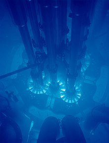

*Réponse publiée [sur Quora](https://fr.quora.com/Quand-un-objet-d%C3%A9passe-la-vitesse-du-son-il-y-a-un-bang-supersonique-hypoth%C3%A9tiquement-si-un-objet-d%C3%A9passe-la-vitesse-de-la-lumi%C3%A8re-y-aurait-il-un-effet-similaire/answer/Dr-Goulu)*

Oui, le [rayonnement Tcherenkov](w:Effet_Vavilov-Tcherenkov) est l'équivalent du mur du son lorsqu'une particule doit ralentir dans un milieu où la vitesse de la lumière est inférieure à c (vitesse de la lumière dans le vide).

C'est ce qui produit la jolie lumière bleue dans les piscines nucléaires, notamment

