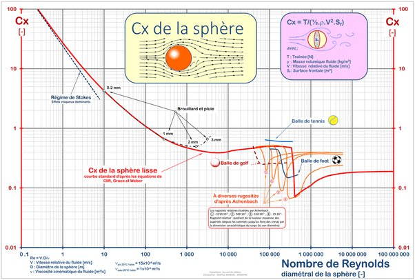

*Réponse publiée [sur Quora](https://fr.quora.com/Comment-calculer-la-force-r%C3%A9sistante-due-%C3%A0-la-friction-de-l-air-pour-un-projectile-sph%C3%A9rique/answer/Dr-Goulu)*

en première approximation en calculant la force de traînée $F_x=\frac{1}{2}\,\rho\,S\,C_x\,V^2$ en utilisant le [Coefficient de traînée](w:) $C_x$de la sphère, qui dépend du [Nombre de Reynolds](w:). Pour un petit projectile très rapide, $C_x=0.2 :$

