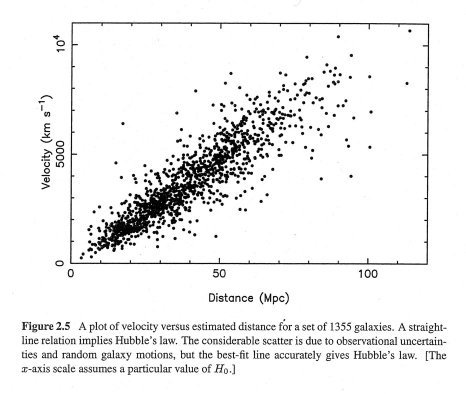

*Réponse publiée [sur Quora](https://fr.quora.com/Lexpansion-%C3%A0-%C3%A9t%C3%A9-observ%C3%A9e-par-des-scientifiques-mais-sagit-il-r%C3%A9ellement-dexpansion-%C3%87e-pourrait-%C3%AAtre-des-galaxies-qui-se-d%C3%A9placent-tout-simplement-car-dans-lUnivers-rien-nest/answer/Dr-Goulu)*

Mais alors pourquoi, en moyenne, une galaxie s'éloigne de nous d'autant plus vite qu'elle est loin ?

La [Constante de Hubble](w:) mesure exactement cette proportionnalité, sur la base de milliers de galaxies observées par différents téléscopes et en utilisant différentes techniques de mesure de la distance.

Vous voyez ce graphique ? Il y a un point pour chacune de 1355 galaxies observées, aux coordonnées x = distance / y = vitesse d'éloignement :

Si on a tout faux, il faut juste expliquer autrement pourquoi les points sont quand même vachement alignés le long d'une droite…
