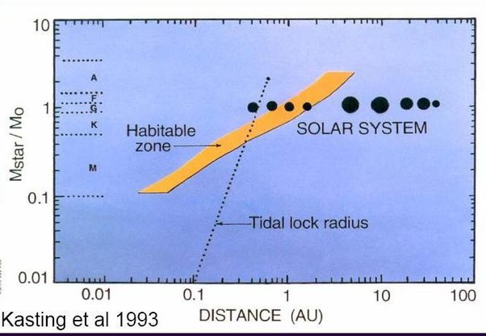

*Réponse publiée [sur Quora](https://fr.quora.com/Que-se-passerait-il-si-le-soleil-avait-une-couleur-diff%C3%A9rente/answer/Dr-Goulu)*

Il aurait donc une température de surface différente, plus chaude s'il était bleu, plus froide s'il était rouge (le contraire des robinets…) , et serait donc soit d'un [Type spectral](w:) différent s'il avait une masse différente, soit à un stade différent de son [évolution](w:Soleil).

La [Zone habitable](w:) évolue comme indiqué dans cette figure en fonction du type spectral (les lettres à gauche, le Soleil est G actuellement) :

Source : [Comment détecter une forme de vie ?](https://media4.obspm.fr/public/ressources_lu/pages_biosignature/impression.html)

Dans tous les cas, la vie serait très différente, ou sur une autre planète du système, ou inexistante.
