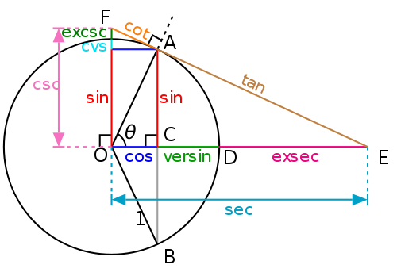

*Réponse publiée [sur Quora](https://fr.quora.com/A-quoi-correspond-1-cosx/answer/Dr-Goulu)*

A la longueur CD notée [versin](w:Sinus_verse) sur la figure, et que je ne connaissais pas,

donc merci pour la question !
