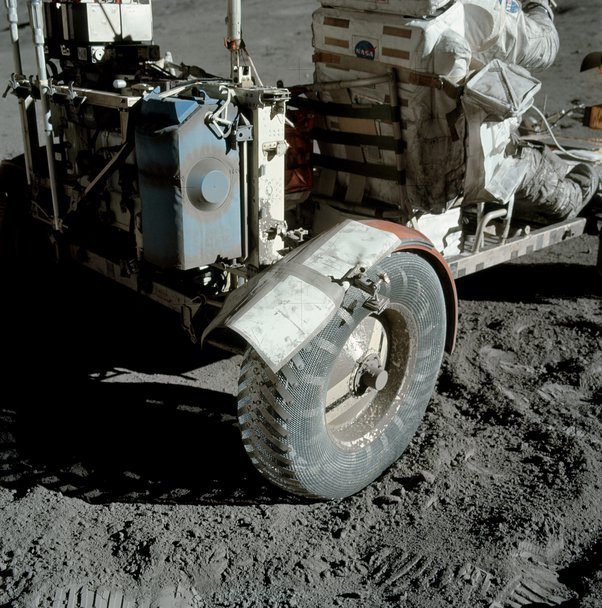
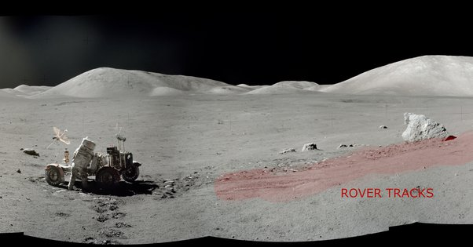

*Réponse publiée [sur Quora](https://fr.quora.com/Pourquoi-cette-photo-du-Lunar-Rover-ne-montre-elle-aucune-trace-de-pneu-devant-ou-derri%C3%A8re-le-pneu/answer/Dr-Goulu)*

Parce que cette photo :

A été prise par Eugene Cernan pour documenter la 2ème réparation de fortune du "garde-boue", ou plutôt du garde-poussière cassé du rover,

juste après avoir fait cette photo:

où l'on voit les traces du rover, effacées juste autour de lui par les pas des astronautes qui ont soulevé plein de poussière lunaire en effectuant la réparation.

(version raccourcie de [C Stuart Hardwick's answer to Why would a photo of the Lunar Rover show no tire tracks in front of or behind the tire?](https://www.quora.com/Why-would-a-photo-of-the-Lunar-Rover-show-no-tire-tracks-in-front-of-or-behind-the-tire/answer/C-Stuart-Hardwick) )

A chaque fois qu'un conspirationniste reçoit une réponse toute simple à une "objection", il devrait se dire que Kubrik a du vraiment penser à tout en faisant son film : le vide, la poussière, la gravité réduite …

Finalement, c'était plus simple d'aller le tourner directement sur la Lune …
