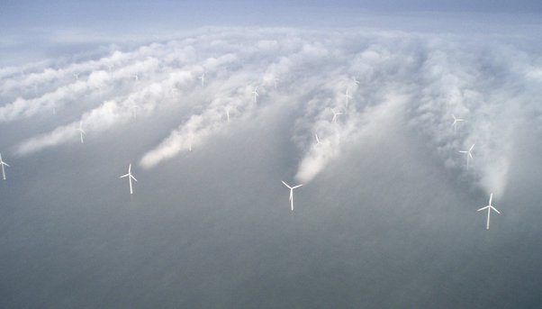

*Réponse publiée [sur Quora](https://fr.quora.com/Pourquoi-ne-fabrique-t-on-pas-d%C3%A9oliennes-avec-plusieurs-h%C3%A9lices/answer/Dr-Goulu)*

On a essayé, mais ça ne vaut pas le coup.

Les éoliennes tripales sont tout près de la [Limite théorique de Betz](w:Limite_de_Betz). Rendre l'éolienne plus complexe, donc plus chère pour quelques pourcents de rendement supplémentaire n'est pas économiquement rentable.

Même en créant des champs éoliens on tombe rapidement sur un problème qu'on voit sur cette photo :

les perturbations du flux d'une éolienne (ici elles provoquent de la condensation) se propagent sur des kilomètres et réduisent le rendement des éoliennes en aval.

source : [Comment optimiser le placement des éoliennes ?](https://www.pourlascience.fr/sd/energie/comment-optimiser-le-placement-des-eoliennes-15772.php) - Pour la Science
