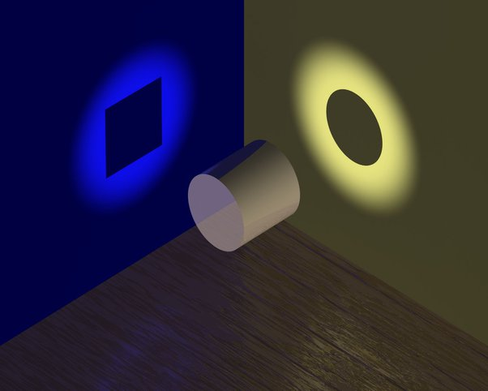

*Réponse publiée [sur Quora](https://fr.quora.com/Comment-d%C3%A9crire-la-dualit%C3%A9-onde-corpuscule-de-fa%C3%A7on-vraie-sans-vulgariser-au-point-que-%C3%A7a-devienne-magique/answer/Dr-Goulu)*

Le [Dossier - La Lumière de Podcast Science](https://www.podcastscience.fm/dossiers/2011/05/26/dossier-la-lumiere/) est la meilleure vulgarisation que je connaisse, et il commence par cette image avec cette légende:

> 
>
>
>
> Quand on dit que la lumière est à la fois onde et particule, ce sont des manières de voir les choses et non pas les choses en elles-même, ce sont des **représentations**.

La lumière (ou d'autres "choses" à très petite échelle) sont ce qu'elles sont, mais nous n'avons pas de moyen de les percevoir directement. Nous nous les représentons en langage humain en les projetant sur des "plans" que nous connaissons à notre échelle : les particules et les ondes, et nous décrivons le comportement de ces "choses" sur ces deux plans en disant "c'est les deux à la fois", mais c'est probablement réducteur.

Les physiciens et matheux ont inventé des manières de représenter ces "choses" de façon plus rigoureuse comme la [Notation bra-ket](w:) par exemple, en développant au passage la [Théorie des représentations](w:) .

Comme je n'ai pas vraiment compris ce que les matheux appellent "représentation", je ne peux que noter la proximité avec les "représentations" ondulatoires et corpusculaires en espérant que ça ait un rapport ([Hadrien Chevalier](https://fr.quora.com/profile/Hadrien-Chevalier) ?)
