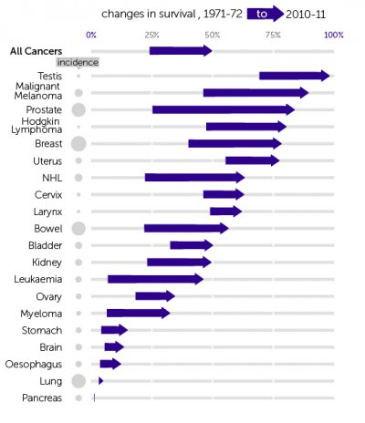

*Réponse publiée [sur Quora](https://fr.quora.com/Est-ce-que-l-industrie-du-cancer-est-une-escroquerie-qui-essaie-d-amener-les-gens-%C3%A0-donner-de-l-argent-pour-une-cause-en-sachant-tr%C3%A8s-bien-qu-il-n-y-aura-jamais-de-rem%C3%A8de-contre-le-cancer/answer/Dr-Goulu)*

Depuis 1970, les chances de survivre à un cancer ont doublé.

