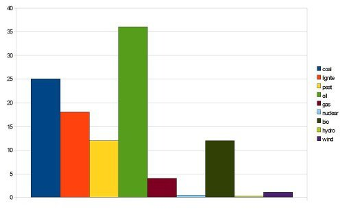

*Réponse publiée [sur Quora](https://fr.quora.com/Au-1er-janvier-2019-450-r%C3%A9acteurs-nucl%C3%A9aires-%C3%A9taient-op%C3%A9rationnels-dans-le-monde-Ensemble-ils-produisent-11-de-l%C3%A9lectricit%C3%A9-mondiale-%C3%80-votre-avis-cette-production-de-11-p-100-vaut/answer/Dr-Goulu)*

Il faut comparer au risque des autres sources d'énergie.

Mesuré en morts par Terawattheure produit, ça donne ça :

Source : [http://citeseerx.ist.psu.edu/vie...](http://citeseerx.ist.psu.edu/viewdoc/summary?doi=10.1.1.180.4490)

(il manque le solaire, mais sur une autre étude il est 3x plus mortel que l'éolien, de mémoire)

En fait le nucléaire est surtout dangereux pour les biens, les km2 de terrains voire de villes à évacuer.

Donc oui, si comme moi vous placez la valeur de la vie humaine au dessus de celle du matériel, les 11% de nucléaire valent tout à fait le risque. On devrait même en faire au moins 100%, puisqu'il faudra 400% de l'électricité actuelle pour remplacer les fossiles.
