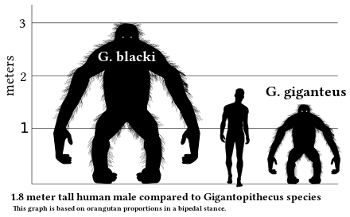

*Réponse publiée [sur Quora](https://fr.quora.com/Quels-sont-les-plus-grands-singes-%C3%A9teints-de-l-histoire/answer/Dr-Goulu)*

[Gigantopithecus blacki](w:Gigantopithèque), qui vivait en asie du sud jusqu'à il y a 100'000 ans environ.

