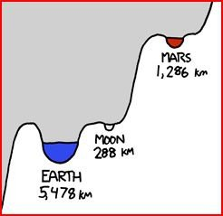

*Réponse publiée [sur Quora](https://fr.quora.com/Puisque-lISS-existe-et-que-lhomme-est-capable-d%C3%A9tablir-de-petites-stations-habit%C3%A9es-dans-lespace-pourquoi-une-station-similaire-na-t-elle-pas-%C3%A9t%C3%A9-construite-sur-la-lune/answer/Dr-Goulu)*

Parce que la Lune est beaucoup, beaucoup plus haut que l'orbite de l'ISS dans le [Puits gravitationnel](w:) de la Terre

Ce petit dessin de XKCD (détail d'[un beaucoup plus grand](http://xkcd.com/681_large/)) illustre ceci:

La Lune étant 6379/155 = 41.5 fois plus haut que l'ISS dans le puits, il faut 41.5 fois plus d'énergie pour y aller, et même 44 fois plus parce qu'il faut en plus freiner la descente des 288 km vers la Lune avec la fusée …

Pour envoyer 2 types et quelques tonnes de matos sur la Lune, il a fallu les plus grosses fusées jamais réalisées. Nous n'avons absolument pas les moyens d'en envoyer une tous les mois pour ravitailler une base lunaire.

Une autre façon de le dire est que l'ISS n'est pas "dans l'espace". Elle est à peine en dehors de l'atmosphère.

Une fois que vous avez bien compris ça, vous êtes prêts pour comprendre le problème d'aller sur Mars :

[Un petit pas pour l'homme ... dans un petit puits gravitationnel. - Pourquoi Comment Combien](/2012/09/05/un-petit-pas-pour-lhomme/)
