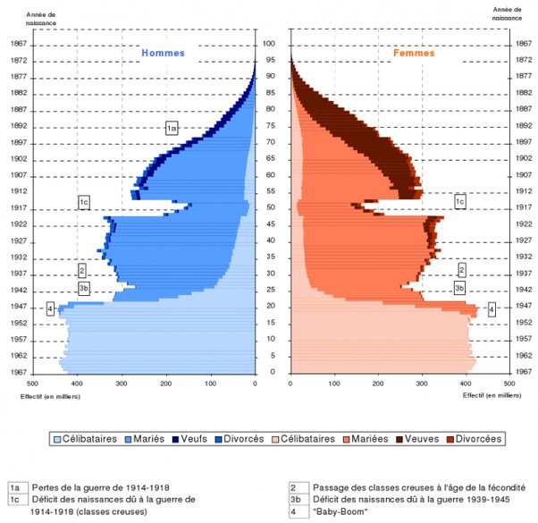

*Réponse publiée [sur Quora](https://fr.quora.com/A-t-on-jamais-mener-une-%C3%A9tude-d%C3%A9mographique-s%C3%A9rieuse-afin-d%C3%A9tablir-quelle-serait-la-population-mondiale-daujourdhui-si-la-premi%C3%A8re-et-seconde-guerre-mondiale-navaient-jamais-eu-lieu/answer/Dr-Goulu)*

Si, et le résultat est surprenant : la population serait la même. Après chaque guerre, le taux de natalité augmente très fortement et "compense" les morts très vite.

Voici par exemple la pyramide des âges de la France en 1968 :

De 1914 à 1918, le niveau des naissance a baissé de près de 50% du fait de la guerre, surtout par l’absence des pères au front, mais aussi à cause des ravages de la grippe espagnole, créant d’impressionnantes entailles dans la pyramide. 20 ans plus tard, ces “classes creuses” arrivent à maturité en même temps que la seconde guerre mondiale : les deux causes de déficit se combinent, mais ne provoquent pas un creux aussi important qu’en 14-18. Mais juste après il se passe quelque chose d’étonnant : le niveau des naissances bondit et se stabilise pendant plusieurs années consécutives

[Pyramides et populations - Pourquoi Comment Combien](/2011/02/06/pyramides-et-populations/)
