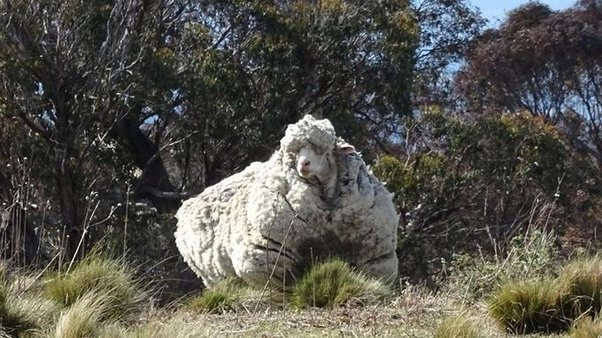

*Réponse publiée [sur Quora](https://fr.quora.com/Que-se-passerait-il-si-un-mouton-n-%C3%A9tait-jamais-tondu/answer/Dr-Goulu)*

Au bout de 6 ans, ça donne ça:

[Australie : un mouton tondu en urgence après des années d'errance](http://www.lefigaro.fr/international/2015/09/03/01003-20150903ARTFIG00222-australie-un-mouton-deleste-de-40-kilos-de-laine.php)

Le mouton portait 40 kg de laine, il pouvait à peine se déplacer. S'il n'avait pas été (facilement) capturé , il serait certainement mort peu après.
